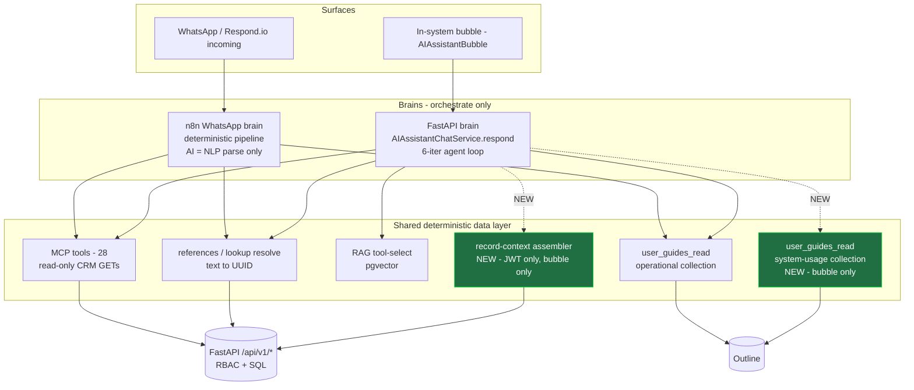
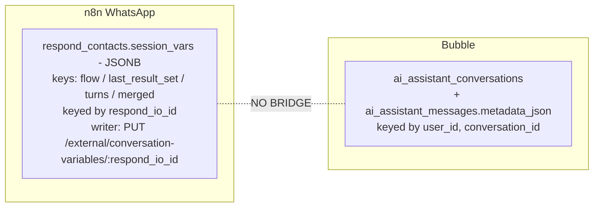
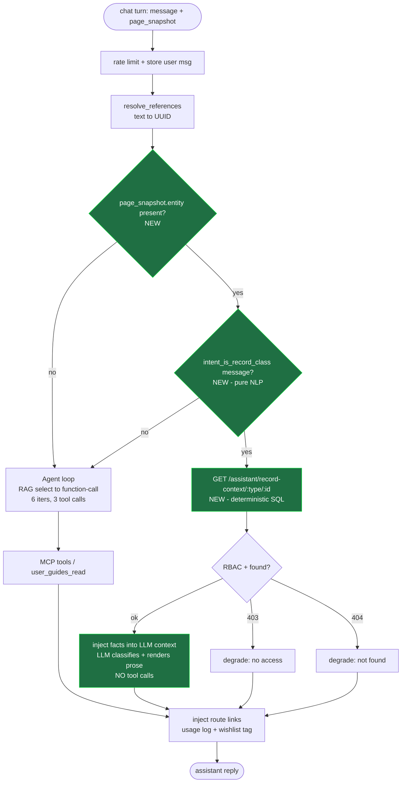
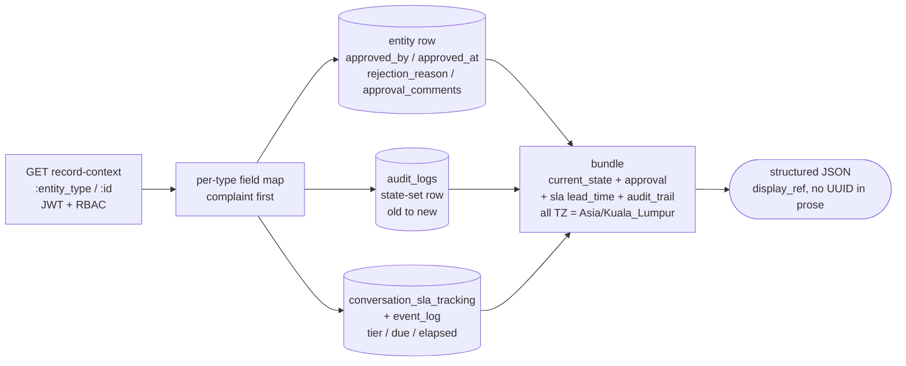
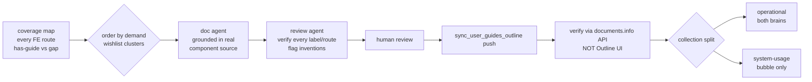

# Architecture - Bubble Record-Context + System Guides

**Companion to:** [`PLAN-bubble-record-context-and-guides.md`](./PLAN-bubble-record-context-and-guides.md) · [`UAC-bubble-record-context-and-guides.md`](./UAC-bubble-record-context-and-guides.md)

Diagrams are Mermaid - render in GitHub / any Mermaid viewer. `NEW` = added by this plan.

---

## 1. Two brains, one deterministic data layer

The anti-drift rule: brains **orchestrate**, they don't **own answers**. Both consume the same data layer. The assembler + system-usage guide are the only intentionally bubble-only additions (Q7 scope).

**Scope firewall (Q7):** `ASM` and `GUIDE_SYS` have no path from `N8N`. The assembler is a JWT-only route - never an `EXTERNAL_API_KEY` MCP tool - so n8n/WhatsApp physically cannot reach it. UAC §3.6 asserts the EXTERNAL_API_KEY principal is denied.

**Conversation-state isolation (UAC §4.7):** the two brains keep per-conversation state in **separate stores** - they must never share a column.

`AIAssistantChatService` has zero reads/writes of `session_vars` (grep-clean). The assembler is read-only - it must not persist anything onto the contact. Mixing them would cross-contaminate the same person's WhatsApp and bubble state. Pinned by `test_bubble_path_never_writes_contact_session_vars`.

---

## 2. Bubble chat turn - the pre-route decision (the regression firewall)

Today every turn goes through the agent loop. The plan inserts one deterministic fork **before** the loop. The fork is the entire regression risk: it must divert **only** `entity + record-class` turns.

**Mapped to UAC §3:**

| Path through the fork | UAC row | Must hold |
|-----------------------|---------|-----------|
| entity ✓ + record-class ✓ → `ASM` | §3.1 | assembler answers, `tool_calls` empty |
| entity ✓ + record-class ✗ → `LOOP` | §3.2 | catalog question still hits MCP - **no theft** |
| entity ✓ + procedural → `LOOP` → `user_guides_read` | §3.3 | guide answers how-to |
| entity ✗ → `LOOP` | §3.4 | no assembler without an id |
| `ASM` → 403 / 404 | §3.5 / §3.7 | graceful degrade |

The two load-bearing edges are `FORK -- no` and `CLS -- no`: both route back to the **unchanged** agent loop. Sections 1 & 2 of the UAC live on those edges.

---

## 3. Record-context assembler - data sources (Q4a)

Pure SQL assembly, no AI. One shared response shape across all 4 entity types; a per-type field map fills it. Complaint is the tracer.

- `approval` is null when the entity has no approval gate; `sla` is null when no tracker.
- `lead_time` always returns `{elapsed, target, breached}` (Q8).
- All 4 entities (complaint, purchase_request, sponsorship_form, stock_inquiry) share `conversation_sla_tracking` discriminated by `source_entity_type` - the field map abstracts the per-type column names.

---

## 4. Guide pipeline (Track B - parallel)

Two gates, no auto-publish (Q5 review): doc agent → review agent → human → Outline. Verify links via API, never the Outline UI (it strips query-bearing links - CLAUDE.md lesson).

---

## Deliverable map

| Artifact | File |
|----------|------|
| Design + decisions | `PLAN-bubble-record-context-and-guides.md` |
| Acceptance criteria | `UAC-bubble-record-context-and-guides.md` |
| This architecture | `ARCH-bubble-record-context-and-guides.md` |
| Pre-route regression guard (dormant test-first) | `sorento_crm_backend/tests/test_ai_assistant_record_context_preroute.py` |
