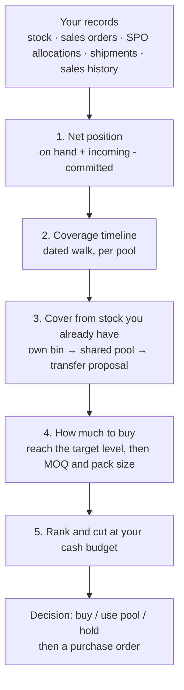

# How the reorder plan is derived

For explaining the module to stakeholders, and for auditing it. Every figure below is traced
to the table or view it comes from. Nothing in the planning path is generated by a language
model: the numbers are arithmetic over your own records, and the only AI in the screen is an
optional sentence that restates them (and now only when somebody clicks for it).

## The one-line version

> For every product at every stocking location, the system lays your commitments and your
> incoming supply on a calendar, walks the balance forward day by day, and reports the WORST
> point. If the worst point is a shortage, it buys enough to reach the target level, from the
> supplier your own receipt history says is best. Then it ranks the buys and cuts the list at
> your cash budget.

Two things it deliberately does NOT do: it does not average a shortage away (a peak deficit is
the number, not the closing balance), and it does not invent a figure it was never given (a
missing cost, volume or lead time is reported as missing).

## What feeds it

| Input | Where it comes from | The rule |
|---|---|---|
| **On hand** | `stock`, filtered to warehouses where `counts_as_available` is true | Config, default true. A bin is only excluded when an admin says so. |
| **Committed demand** | `sales_order_lines` on `sales_orders` with `status = 'open'`, line `open`, `qty_ordered > qty_delivered` (`scm.committed_v`) | A line closed short is no longer a commitment. |
| **When demand is due** | `sales_order_lines.required_date`, else the order's `requested_delivery_date` | A line with NEITHER date is reported as undated, never dated today: pretending it is due now would fabricate a shortage. |
| **Incoming supply** | `spo_allocations` on inbound shipments not yet received (`scm.on_order_v`) | **The SPO allocation is the only supply.** See "Why a purchase order is not supply" below. |
| **Ordered (not supply)** | `purchase_order_lines` on POs with `status IN (active, received, partial, closed)`, line `open`, `qty_ordered > qty_received` (`scm.po_ordered_v`) | Reported beside the plan, never inside it. **Draft POs are not even ordered** - a draft is a recommendation nobody has committed to. |
| **Sales history (the demand rate)** | `order_lines` joined `orders`, cancelled excluded (`scm.consumption_v`), aggregated into `scm.demand_stat` | ~13 trailing weekly buckets. Steady items use the plain sum; only mid-variability items are trimmed; lumpy items are kept whole so one real spike is not trimmed to zero. |
| **Supplier lead time and reliability** | PO to goods-receipt pairs (`scm.receipt_lead_v`) aggregated into `scm.supplier_performance` | Measured from your own receipts. Below a minimum sample it falls back to the supplier average and says its confidence is lower. |
| **Cost** | `product_suppliers.unit_cost` | No cost means the line cannot be ranked against cash: it goes to a **needs cost** list rather than being priced at zero. |
| **Cash budget** | `scm.purchasing_budget` (global scope, period-aware) | Yours. When none is set, the plan shows itself whole rather than inventing a limit. |

**Net position** = `on hand + incoming - committed`, per product per location
(`scm.net_position_v`). That single figure is the starting point of everything else.

### Why a purchase order is not supply

The chain is **PO -> SPO -> GRN**. A purchase order is an order *placed*; the SPO allocation
is the supplier's actual shipment against it, allocated to a destination warehouse; the GRN is
the receipt. Only the middle one is stock on its way to you, so only the middle one is counted.

The live book settles the argument: **9 open purchase-order lines against 842 in-transit
allocations carrying about 203,000 units**. Reading supply off the PO half reported almost
none of the stock actually coming.

The two are not netted against each other because nothing links them: `spo_allocations.po_line_id`
is empty on every existing row, so counting both would double every order the supplier has
already shipped.

**The exposure this accepts, stated plainly:** between placing an order and the supplier's first
shipment against it, that order is not cover, so the plan can recommend buying the same thing
again. The mitigation is that the ordered quantity is always on screen next to the shortfall -
a buyer looking at "short 500" can see "500 already ordered" and hold. It is a figure a person
reads, never a figure the arithmetic uses.

## The five steps



### 1. Net position

Per product per location, from the three sources above. A negative net position means you are
already committed beyond what you hold and have coming.

### 2. The coverage timeline: dated, and the worst point wins

**The plan is dated, and re-running it tomorrow gives a different answer.** That is by design,
not drift: the timeline is walked from today over the horizon, so an order due on the 12th is
three days out on the 9th and one day out on the 11th. `scm.net_position_v` is the opposite -
one undated snapshot of on hand plus incoming minus committed, with no calendar at all - and
the two are meant to disagree. A frozen run keeps the dated answer the decider actually saw.

Every commitment and every incoming receipt is placed on the date it is due, and the balance
is walked forward over the planning horizon (default 6 months, configurable). The screen shows
four figures for that walk:

- **Opening balance** - what you hold today.
- **Peak deficit** - the worst point of the walk. *This is the number that drives the buy*, not
  the closing balance. An order due in June and a container arriving in August net out to a
  healthy closing figure while leaving you out of stock for two months; the closing balance
  hides exactly the problem the plan exists to find.
- **Closing balance** - where the horizon ends up.
- **Incoming** - allocated shipments on their way in. Beside it, **ordered**, which is on a
  purchase order with nothing shipped against it yet and is deliberately not in the balance.

Each row of the timeline names the document behind it, so any figure can be checked against a
sales order or a purchase order the planner recognises.

### 3. Cover it from stock you already have, before buying

The unit of netting is the **pool**, not the individual bin. A location's `pool_warehouse_id`
says which shared pool it may draw on, so a shortage at `BRW-BB` is covered from `BRW` first
and never becomes a purchase. The screen states the split: **own bin**, **shared pool**, **other
bins**.

Stock at *another site* is deliberately NOT netted. Moving it costs money and takes days, so it
surfaces as a **transfer proposal** carrying that cost and lead time for a person to accept.
Silent netting across sites would produce a plan that assumes free, instant movement.

### 4. How much to buy

Locked formulae (unchanged since M3, golden-tested against an independently derived fixture):

```
safety stock (fixed days) = demand rate x safety days                    (default 7 days)
safety stock (statistical) = Z(service level) x sqrt(LT x sigma_d^2 + demand^2 x var_LT)
reorder point (ROP)       = demand rate x lead time + safety stock
target level (S)          = ROP + demand rate x review period            (default 30 days)
recommended qty           = S - net position        (0 when not triggered)
order qty                 = ceil(max(recommended, MOQ) / pack size) x pack size
```

**Only `fixed_days` is in use.** Every configured policy selects it, so today safety stock is
literally `demand rate x safety days` (7 by default). The statistical formula is implemented
and available per policy, and falls back to fixed-days on a thin sales history rather than
trusting a standard deviation computed from three data points.

**The unit of the demand rate is whatever unit your sales lines are in.** It is average units
per day, taken straight from delivery-order line quantities, with no unit conversion anywhere
in the chain: a product sold in pieces gives pieces per day, one sold in sets gives sets per
day. Everything downstream (safety stock, reorder point, target level, order quantity) carries
that same unit.

It triggers when `net <= ROP` (reorder point policy), on cadence when below target (periodic
review), or at the minimum (min/max). Thin sales history falls back from the statistical safety
stock to the fixed-days one rather than trusting a standard deviation computed from three data
points. Defaults when a supplier has no measured figure: **lead time 30 days**, **service level
95%** - both visible on the row and both overridable by policy.

A **network buy** aggregates the whole company's position for one product (a purchase order is
raised once for the company), then allocates the quantity across locations deficit-first and
distributes any surplus by velocity, so the parts sum exactly to the buy.

Two dispositions come out of the same walk: **dead** (no movement for longer than the dead-stock
window; when there is no movement at all, ageing since last purchase is used and labelled as
such) and **overstock** (cover beyond the overstock ceiling).

### 5. Rank, then cut at your cash budget

Ranking is a weighted score of factors, each normalised 0 to 1, and **a factor that cannot be
computed is dropped from the average rather than counted as zero** - an item with no margin on
file must not be pushed down for it. Every row on the screen can be opened to see its own
factor vector, weight by weight.

The cut is a greedy fill by rank against your budget, with three honest outcomes: **funded**,
**deferred** (with the reason), and **needs cost** (cannot be ranked against money at all). A
line can be pinned to force it in, which shows as an overspend rather than quietly evicting
something else.

Nothing here writes a purchase order. The planner decides the quantity, the buyer keys it, and
the keyed status is manual because no AutoCount integration exists to detect it.

## What the module refuses to do

These are design decisions, not gaps, and each one exists because the alternative produces a
confidently wrong number:

- **No purchase order counts as supply.** An order placed is not stock on the water; the SPO
  allocation against it is. The order is reported, never counted.
- **An undated commitment is reported, not dated today.**
- **A missing cost, volume or dimension stays missing.** Zero would read as "free" or "takes no
  space" and win the ranking.
- **No cross-site netting without a person.** It is a proposal with a cost and a lead time.
- **No invented cash budget.** Yours, or the whole plan.
- **The plan is frozen when it runs.** A past run shows what the decider actually saw; the order
  book moves daily, so recomputing it would be a different report wearing the same date.

## Where the numbers live

| Read model | Answers |
|---|---|
| `scm.net_position_v` | on hand + on order - committed, per product per location |
| `scm.on_order_v` / `scm.committed_v` | incoming supply (SPO allocations) / open commitments |
| `scm.po_ordered_v` | placed on a purchase order, reported beside the plan and never in it |
| `scm.consumption_v` | daily outflow history |
| `scm.receipt_lead_v` | PO to receipt pairs, for measured lead time |
| `scm.demand_stat` | demand rate and variability per product per location |
| `scm.item_classification` | ABC (value) and XYZ (variability) |
| `scm.supplier_performance` | on-time, lead time, variance, composite score |
| `scm.reorder_policy` | the rules, resolved SKU > cell > class > global |
| `scm.reorder_run` / `scm.reorder_recommendation` | one planning run and its frozen recommendations |
| `scm.order_summary_row` | the frozen Summary Order Report plus the decision taken |
| `scm.purchasing_budget` | your cash budget |
